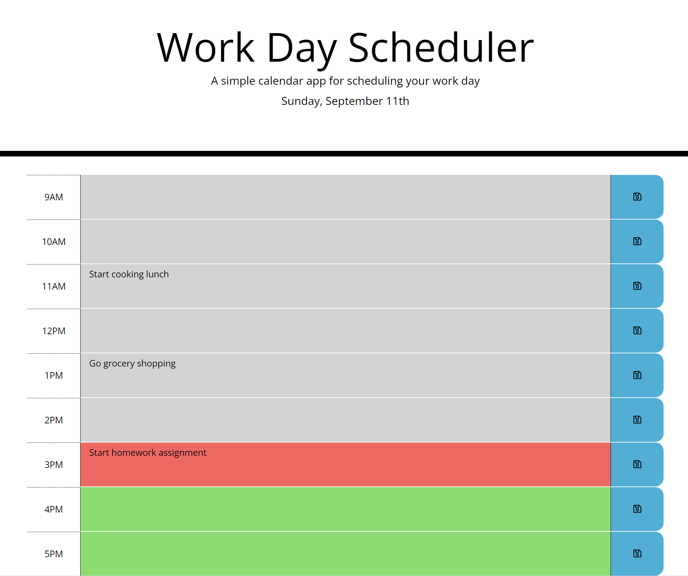

# Workday Scheduler using Moment.js

## Description

This application is a day planner which allows the user to schedule their day by saving tasks to a block of time and stay on track with color indicators for upcoming time/tasks.

This project was a great exercise to build upon the skills gained thus far. In addition to HTML, CSS and Javascript, I was able to leverage Bootstrap to control the display of the page and jQuery to finetune the operation of the application.

## Installation

N/A

## Usage

The deployed application can be found [here](https://amaragh.github.io/day-scheduler/).

In addition to HTML, CSS and Javascript, Bootstrap and jQuery are also used to achieve the page's display and functionality.

When a task is saved on the page, it is also pushed to `localStorage` and is reloaded to the page whenever it is refreshed.

The colors of the time blocks are dependent on the the relation between the time listed on the block and the time at which the day scheduler application is being loaded. TIme blocks in the past will be grey, the time block for the current hour will be red, and future time blocks will be green.

The application contains functionality to re-evaluate the time against each of the time blocks at regular intervals so that the color indications remain up to date. Below is a screenshot of the application when in use.

## Credits

N/A

## License

Please refer to the license in the repo.